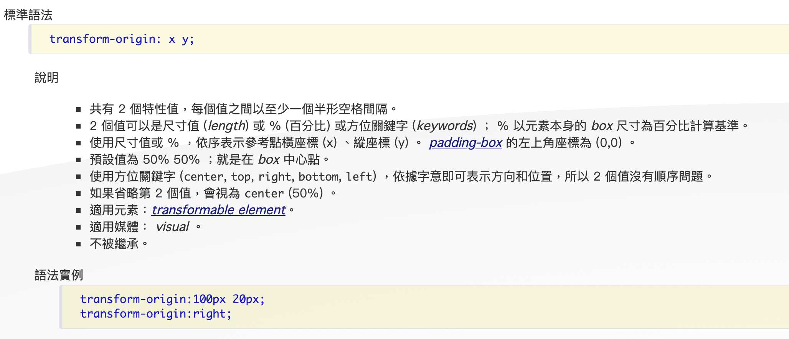

# [JS30 筆記]Day2 - JS And CSS Clock
## 心得
沒想到Day2就寫到時鐘了，這題算是我的心魔，上個月看到有人做的精美時鐘，看了一下code大概知道我不懂的兩個點：
1. 不知道怎麼讓旋轉的軸心在指針底端（當時不知道可以移動軸心）
2. 還不太了解 `setTimeout`及 `setInterval`

結果這次寫起來意外的輕鬆，比較麻煩的反而是看懂作者的code，我還蠻不習慣他的寫法的，所以後來稍微改了一下style，寫成我習慣的樣式，第二天就破除心魔，那第三天的挑戰到底是什麼呢！  
這次的寫法比較不一樣，是先看完作者的code再看Alex的解說，覺得效果不錯，而且可以培養看別人code + 自己找答案的能力，就決定Day3也這樣搞了！
## 紀錄知識點
1. [`transform-origin` 改變軸心](#`transform-origin`改變軸心)
2. [動畫三劍客 `setInterval`、`setTimeout`、`requestAnimationFrame`](#動畫三劍客`setInterval`、`setTimeout`、`requestAnimationFrame`)
3. [角度計算](#角度計算)

### `transform-origin`改變軸心
[transform好文](https://boohover.pixnet.net/blog/post/35341387)  
`transform-origin`可以改變旋轉、縮放等`transform`底下的各種屬性  
`transform-origin`有兩個參數分別對應x,y軸，可以使用top、left、center、bottom等文字屬性、單位長度或百分比
不說了直接上圖片

### 動畫三劍客`setInterval`、`setTimeout`、`requestAnimationFrame`
[超詳細動畫三劍客分析文](https://www.cnblogs.com/spoem/p/13214089.html)  
這三個好像跟同步異步有關係，逛了幾篇文看到各自的優缺點，但其實不是很理解其中原因，但大概整理一下
- `setInterval(function,interval)` 設定間隔，不停調用
- `setTimeout(function,timeout)` 設定下次調用要使用多少時間，調用一次
- `requestAnimationFrame()` 依照電腦最快能刷新頁面的速度(Hz)刷新一次，並且沒有被focus時不會繼續運行（省CPU）

簡單來說處理「畫面」最優解應該是`requestAnimationFrame()`，不會出現一些掉幀等問題，並且可以自適應螢幕刷新率改變更新頻率，沒被focus時也會休息（省CPU）
### 角度計算
一圈360deg
一圈60秒
一圈60分鐘
一圈12小時

一秒幾度？
360deg/60秒 = 6deg  
一分鐘幾度？
360deg/60分鐘 = 6deg +
下一個6deg/60秒*現在幾秒  
一小時幾度？
360deg/12小時 = 30deg +
下一個30deg/60分鐘*現在幾分鐘

if現在時間 = h時m分s秒  
各應該佔幾度？  
s == s * 6deg  
m == m * 6deg + 6deg * (s /60)  
h == h * 30deg + 30deg * (m/60) 